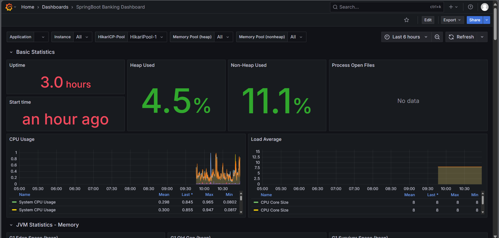
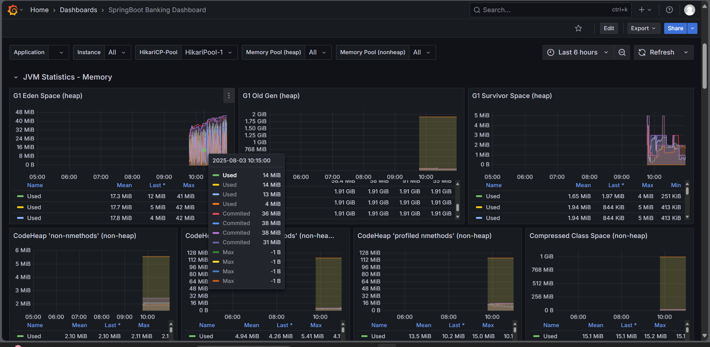

<div align="center">

```
CURREN-BANK
```
<p align="center">
  
</p>
### **Enterprise-Grade Full-Stack Digital Banking Platform**

*Microservices · Event-Driven · Cloud-Native · Production-Ready*

---

[](https://clearledger.vercel.app/)
[](LICENSE)
[](docker-compose.yml)
[](https://openjdk.org/)
[](https://spring.io/)
[](https://reactjs.org/)
[](https://kafka.apache.org/)
[](https://kubernetes.io/)

</div>

---

## 📌 Table of Contents

- [Project Overview](#-project-overview)
- [Why ClearLedger Stands Out](#-why-clearledger-stands-out)
- [System Architecture](#-system-architecture)
- [Backend Microservices](#-backend-microservices)
- [Security Model](#-security-model)
- [Frontend](#-frontend-react--vite)
- [Monitoring & Observability](#-monitoring--observability)
- [DevOps & Deployment](#-devops--deployment)
- [Kubernetes (K8s)](#-kubernetes-k8s)
- [Tech Stack](#-tech-stack)
- [Quick Start](#-quick-start)
- [Service Access URLs](#-service-access-urls)
- [What This Project Proves](#-what-this-project-proves)

---

## 🏦 Project Overview

**ClearLedger** is a **real-world, production-inspired enterprise banking platform** — not a CRUD demo.

It simulates how modern FinTech companies architect digital banking systems at scale: distributed microservices with clearly defined boundaries, event-driven communication via Kafka, bank-grade JWT security, payment gateway integration, real-time monitoring, and full Kubernetes orchestration.

> Built to demonstrate mastery of backend engineering, distributed systems, DevOps, and cloud-native architecture — all in a single cohesive project.

---

## ✨ Why ClearLedger Stands Out

| Capability | Implementation |
|---|---|
| 🔐 Bank-Grade Security | JWT RS256 + RBAC + Redis token management + BCrypt |
| ⚡ Real-Time Event Streaming | Apache Kafka for transactions, notifications, auditing |
| 💳 Live Payment Gateway | Razorpay integration for real money flow |
| 🧩 True Microservices | 9 independently deployable services |
| 🌐 Service Discovery | Netflix Eureka + Feign Clients |
| 📊 Full Observability | Prometheus + Grafana dashboards |
| 🐳 One-Command Startup | Docker Compose — everything up instantly |
| ☸️ Kubernetes Ready | HPA auto-scaling, rolling deployments, health probes |
| ⚡ High Performance | Redis caching for low-latency reads |
| 🧪 Production Reliability | DB transactions, pessimistic locking, Kafka DLQ |

---

## 🏗️ System Architecture
                                   ┌──────────────────────────────────────────────┐
                                   │                CLIENT LAYER                  │
                                   │        React + Vite Frontend (SPA)           │
                                   │   Customer Portal · Admin Dashboard          │
                                   └───────────────────────┬──────────────────────┘
                                                           │ HTTPS
                        ┌──────────────────────────────────▼──────────────────────────────────┐
                        │                           API GATEWAY (8080)                         │
                        │  JWT Validation · Rate Limiting · Routing · API Security · Logging  │
                        └───────┬────────┬────────┬────────┬────────┬────────┬────────┬───────┘
                                │        │        │        │        │        │        │
           ┌────────────────────▼┐ ┌─────▼────┐ ┌─▼───────┐ ┌▼──────┐ ┌▼──────┐ ┌▼──────┐ ┌▼────────┐
           │   Auth Service      │ │User Serv.│ │Account   │ │Txn    │ │Loan   │ │Payment│ │Notif    │
           │   (8081)            │ │ (8082)   │ │Service   │ │Service│ │Service│ │Service│ │Service  │
           │ JWT · OAuth2 · RBAC │ │Profiles  │ │(8083)    │ │(8084) │ │(8086) │ │(8087) │ │(8085)   │
           └─────────────┬───────┘ └────┬─────┘ └────┬─────┘ └──┬────┘ └──┬────┘ └──┬────┘ └──┬─────┘
                         │              │            │          │         │         │         │
      ┌──────────────────▼─────┐ ┌──────▼─────┐ ┌────▼─────┐ ┌──▼──────┐ ┌▼────────┐ ┌▼────────┐ ┌▼────────┐
      │ KYC Service            │ │ Fraud Det. │ │ Admin    │ │ Audit   │ │ Report  │ │ Config  │ │ Search  │
      │ Identity Verification  │ │ Risk Check │ │ Service  │ │ Service │ │ Service │ │ Service │ │ Service │
      │ Document Validation    │ │ ML Rules   │ │ Controls │ │ Logs    │ │ BI Data │ │ Feature │ │ Global  │
      │ Aadhaar / PAN APIs     │ │ AML Check  │ │ Roles    │ │ History │ │ Export  │ │ Flags   │ │ Search  │
      └─────────────┬──────────┘ └──────┬─────┘ └────┬─────┘ └──┬──────┘ └──┬──────┘ └──┬──────┘ └──┬──────┘
                    │                   │            │           │           │           │           │
                    └───────────────────┴────────────┴───────────┴───────────┴───────────┴───────────┘
                                         │
                           ┌─────────────▼─────────────────────────────────────────────┐
                           │                     KAFKA EVENT BUS                        │
                           │ account.events · transaction.events · loan.events         │
                           │ payment.events · notification.events · audit.events       │
                           │ fraud.events · kyc.events                                  │
                           └────────────────────────────────────────────────────────────┘
                                         │
             ┌───────────────────────────┼───────────────────────────┐
             │                           │                           │
     ┌───────▼────────┐          ┌───────▼────────┐           ┌───────▼────────┐
     │ MySQL Cluster  │          │ Redis Cluster  │           │ Elasticsearch  │
     │ Transactions   │          │ Cache · Tokens │           │ Logs · Search  │
     │ Accounts       │          │ Rate Limits    │           │ Audit Queries  │
     └────────────────┘          └────────────────┘           └────────────────┘
             │
     ┌───────▼───────────────────────────────────────────────────────────────────┐
     │                Service Discovery & Infrastructure Layer                   │
     │                                                                           │
     │  Eureka Server · Config Server · Distributed Tracing (Zipkin/Jaeger)     │
     │  Centralized Logging (ELK Stack) · Circuit Breaker (Resilience4j)        │
     └───────────────────────────────────────────────────────────────────────────┘
             │
     ┌───────▼───────────────────────────────────────────────────────────────────┐
     │                   Observability & DevOps Layer                            │
     │                                                                           │
     │  Prometheus · Grafana · Alertmanager · Loki                               │
     │  Kubernetes HPA · CI/CD (GitHub Actions / ArgoCD)                         │
     └───────────────────────────────────────────────────────────────────────────┘
---

## 🧩 Backend Microservices

Each service is **independently deployable**, owns its own database schema, and communicates asynchronously via **Kafka** and synchronously via **Feign Clients** where needed.

### Service Registry

| Service                  | Port   | Responsibility |
|--------------------------|--------|---|
| **API Gateway**          | `8080` | Single entry point — JWT validation, rate limiting, intelligent routing |
| **Auth Service**         | `8081` | Login, registration, JWT RS256 issuance, refresh token lifecycle |
| **User Service**         | `8082` | User profiles, KYC management, account linking |
| **Account Service**      | `8083` | Bank account creation, balance management, account types |
| **Transaction Service**  | `8084` | Fund transfers, transaction validation, history & ledger |
| **Notification Service** | `8085` | Email, SMS, in-app alerts triggered by Kafka events |
| **Loan Service**         | `8086` | Loan applications, EMI calculations, repayment lifecycle |
| **Kyc Service**          | `8087` | Identity verification, document upload (PAN/Aadhaar), KYC approval workflow |
| **Admin Service**        | `8088` | Admin dashboard, user management, system-wide oversight |
| **Payment Service**      | `8089` | Razorpay integration — money top-up, payment verification |
| **Eureka Server**        | `8761` | Service discovery & health registry for all microservices |


## 🔐 Security Model

ClearLedger implements **bank-grade, multi-layered security** throughout the entire stack.

```
┌─────────────────────────────────────────────────────────────┐
│                    SECURITY LAYERS                           │
├─────────────────────────────────────────────────────────────┤
│  1. JWT RS256          Asymmetric signing (private/public)  │
│  2. RBAC               ADMIN / MANAGER / USER roles         │
│  3. Redis Token Store  Stateless sessions with revocation   │
│  4. BCrypt Hashing     Salted password storage              │
│  5. OTP Verification   High-value transaction approval      │
│  6. Rate Limiting      API Gateway — per-IP request limits  │
│  7. IP Tracking        Suspicious access detection          │
└─────────────────────────────────────────────────────────────┘
```

**Why RS256?**
Unlike HS256 (symmetric), RS256 uses a **private key to sign** and a **public key to verify** — meaning only the Auth Service can issue tokens, while all other services can validate them without knowing the secret. True zero-trust design.

---


## 🖥️ Frontend (React + Vite)

**Stack:** React · Vite · Tailwind CSS · Axios · JWT Auth Flow

<p align="center">
  
</p>

**Features:**
- 🔑 JWT-based authentication with token refresh
- 👤 Role-based UI — Admin sees different panels than Users
- 💸 Real-time fund transfer with OTP confirmation
- 📈 Transaction history with filtering & pagination
- 🏦 Loan application wizard with EMI preview
- 💳 Razorpay payment modal for account top-up
- 📱 Fully responsive across all screen sizes

---

## 📊 Monitoring & Observability

Full observability stack for understanding system health in real time.

| Tool | Purpose |
|---|---|
| **Prometheus** | Scrapes metrics from Spring Boot Actuator endpoints |
| **Grafana** | Dashboards for visualization and alerting |
| **Spring Actuator** | Exposes `/actuator/metrics`, `/health`, `/info` |

<p align="center">
  
  
</p>
**Tracked Metrics:**
- 📈 Request throughput & latency (p50, p95, p99)
- ❌ HTTP error rates per service
- 🔁 Kafka consumer lag per topic
- 🧠 JVM heap usage, GC pauses, thread count
- 💾 MySQL query performance & connection pool
- ⚡ Redis cache hit/miss ratio
- 💰 Business metrics: transactions/sec, loan approvals/hr

---

## 🐳 DevOps & Deployment

### Docker Compose (Local / Dev)

The entire platform runs with a **single command**:

```bash
# Clone the repository
git clone https://github.com/Akash-Adak/ClearLedger.git
cd ClearLedger

# Start all services
docker-compose up -d

# Stop all services
docker-compose down
```

**Services started automatically:**
- All 11 microservices
- MySQL (with schema auto-init)
- Redis
- Apache Kafka + Zookeeper
- Prometheus + Grafana
- Eureka Server

> ⏳ First startup may take 3–5 minutes as images are pulled and services initialize.

---

## ☸️ Kubernetes (K8s)

ClearLedger is fully **Kubernetes-ready** for production-grade deployment.


**K8s Features:**
- ☸️ **HPA (Horizontal Pod Autoscaler)** — services auto-scale under load
- 🔄 **Rolling Deployments** — zero-downtime updates
- 🏥 **Liveness & Readiness Probes** — automatic restart of unhealthy pods
- 🔒 **Secrets management** — credentials never in plain config
- 📡 **Service mesh ready** — clean service-to-service communication
- 📊 **Prometheus + Grafana** deployed in-cluster for full observability

```bash
# Deploy to Kubernetes
kubectl apply -f k8s/

# Check status
kubectl get pods -n clearledger

# Scale a service manually
kubectl scale deployment transaction-service --replicas=3 -n clearledger
```

---

## 🛠️ Tech Stack

### Backend
| Technology | Version | Usage |
|---|---|---|
| Java | 17 | Core language |
| Spring Boot | 3.x | Microservice framework |
| Spring Security | 6.x | Auth & RBAC |
| Spring Cloud Gateway | Latest | API Gateway |
| Spring Cloud Eureka | Latest | Service Discovery |
| Spring Cloud OpenFeign | Latest | Sync inter-service calls |
| Apache Kafka | Latest | Event streaming |
| MySQL | 8.x | Primary database |
| Redis | 7.x | Caching & token store |
| Razorpay Java SDK | Latest | Payment gateway |

### Frontend
| Technology | Usage |
|---|---|
| React | UI framework |
| Vite | Build tool & dev server |
| Tailwind CSS | Utility-first styling |
| Axios | HTTP client |
| React Router | Client-side routing |
| Context API | Global state management |

### DevOps & Infrastructure
| Technology | Usage |
|---|---|
| Docker | Service containerization |
| Docker Compose | Local orchestration |
| Kubernetes | Production orchestration |
| Helm (optional) | K8s package management |
| Prometheus | Metrics collection |
| Grafana | Visualization & alerting |
| Spring Boot Actuator | Metrics endpoint exposure |

---

## 🚀 Quick Start

### Prerequisites

```
✅ Docker & Docker Compose
✅ Git
✅ (Optional) kubectl + K8s cluster for K8s deployment
```

### Run with Docker Compose

```bash
git clone https://github.com/Akash-Adak/ClearLedger.git
cd ClearLedger
docker-compose up -d
```

### Run on Kubernetes

```bash
# Apply all manifests
kubectl apply -f k8s/

# Watch pods come up
kubectl get pods -n clearledger --watch
```

---

## 🌐 Service Access URLs

| Service                  | URL                   | Description           |
|--------------------------|-----------------------|-----------------------|
| **Frontend**             | http://localhost:9090 | React + Vite app      |
| **API Gateway**          | http://localhost:8080 | Single entry point    |
| **Auth Service**         | http://localhost:8081 | Auth endpoints        |
| **User Service**         | http://localhost:8082 | User/KYC endpoints    |
| **Account Service**      | http://localhost:8083 | Account management    |
| **Transaction Service**  | http://localhost:8084 | Fund transfers        |
| **Notification Service** | http://localhost:8085 | Alert management      |
| **Loan Service**         | http://localhost:8086 | Loan lifecycle        |
| **Kyc Service**          | http://localhost:8087 | Kyc lifecycle               |
| **Admin Service**        | http://localhost:8088 | Admin dashboard       |
| **Payment Service**      | http://localhost:8089 | Razorpay integration  |
| **Eureka Dashboard**     | http://localhost:8761 | Service registry      |
| **Grafana**              | http://localhost:3000 | Monitoring dashboards |
| **Prometheus**           | http://localhost:9090 | Metrics explorer      |

---


## 👨‍💻 What This Project Proves

| Skill Domain | Demonstrated By |
|---|---|
| **Backend Engineering** | 9 Spring Boot microservices with clean service boundaries |
| **Distributed Systems** | Kafka, Eureka, Feign, Redis across services |
| **Security** | RS256 JWT, RBAC, Redis sessions, OTP, BCrypt |
| **Payment Systems** | Real Razorpay integration with signature verification |
| **Event-Driven Design** | Kafka producers/consumers with DLQ and retry |
| **DevOps** | Docker, Docker Compose, full K8s manifests with HPA |
| **Observability** | Prometheus metrics + Grafana dashboards |
| **Frontend** | React + Vite + Tailwind with role-based UI |
| **System Design** | End-to-end ownership — infra, backend, frontend |


---

<div align="center">

**Built with precision. Designed for scale. Ready for production.**

*ClearLedger — Enterprise Digital Banking, End to End.*

</div>
